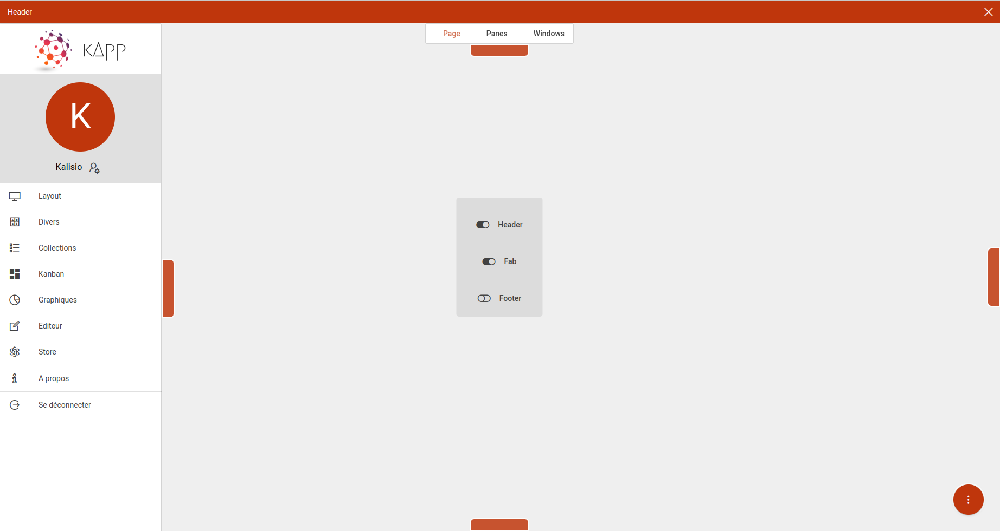

# About

**kApp** is an demonstration application based on the [Kalisio Development Kit](https://kalisio.github.io/kdk/) (**KDK**) available now as a single package [@kalisio/kdk](https://www.npmjs.com/package/@kalisio/kdk).

::: tip
For a deeper understanding of the overall structure, please refer to our [application template](https://kalisio.github.io/skeleton).
:::

It aims at providing a basic example to setup the application server, the client build, the continuous integration and testing, as well as running use cases of KDK components.

