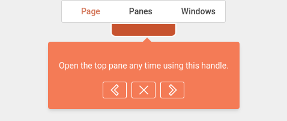

# Tour

Here is a quick rundown of the *key concepts* to handle when you're just starting to use tours.

Tours are designed to help users discover the different features and functionality of the kApp in an interactive way. To generate them, we use the [vue3-tour library](https://github.com/alexandreDavid/vue3-tour) on which we have added several additional features.

::: warning
You will first have to follow the required steps to create your account then connect to make everything works as expected.
:::

You can run the tutorial from this [link](https://kapp.dev.kalisio.xyz/#/home/layout?tour=home), or open the application at the right place then click on the following icon <a href=""><i class="las la-question-circle"/></a> in the main menu.

::: tip
To open the main menu use the handle on the left side of your screen.
:::

You can then follow the step by step guide <a href=""><i class="las la-chevron-right"/></a> (or <i class="las la-arrow-right"/> key), go back if required <a href=""><i class="las la-chevron-left"/></a> (or <i class="las la-arrow-left"/> key) and stop anytime <a href=""><i class="las la-times"/></a> (or *escape* key) as illustrated by the following figure:

## Configuration

The tour configuration in the kApp depends on how many tours you want to associate with a route.

### Set of tours associated with a route

To configure multiple tours associated with a route, you must add a tour object to the route configuration in the `src/router/routes.js` file.
Example of configuration to associate two tours to the layout route:

::: details configuration example
<<< ../../.vitepress/public/router-tours.js
:::

::: tip
You can launch a tour using a query parameter with `tour=tour-name`.
:::

### Only one tour associated with a route

To configure a single tour associated with a route, you must:

1. Add a tour property to the route configuration in the `src/router/routes.js` file.

::: details configuration example
<<< ../../.vitepress/public/router-tour.js
:::

2. Add to the route the query parameter `{ tour: true }` in the `config/default.js` file. For example, `route: { name: 'login', query: { tour: true } }`

::: tip
You can launch a tour using a query parameter with `tour=true`.
:::

## Usage

Tours are located in the `src/tours` folder. When you launch the kApp generic tours are automatically copied from the kdk. They are configured using a JavaScript file exporting an array of objects. Each object describes a step of a tour with the following properties:

- `target`: HTML element you want to highlight
- `title`: Title of the targeted element (String or translation key)
- `content`: Brief description of the targeted element (String or translation key)
- `link`: Textual content of the link  (String or translation key)
- `params` : Object that allows to define additional parameters
  - `placement`: Defines the orientation of the tour step relative to the target element. Possible values are `top`, `bottom`, `left` and `right`. If this property is not specified, the default value is `bottom`
  - `blockOnMiss`: HTML element that allows to block the tour if it is not found in the page
  - `clickOnLink`: HTML element you want to simulate a click on when the link is clicked
  - `tour`: Name of the tour to load if the link is clicked
  - `clickOn`: HTML element on which a clik is generated at the beginning of the step
  - `clickDelay`: Time in milliseconds before `clickOn` is executed
  - `clickOnNext`: HTML element on which a click is generated when the next button is clicked
  - `nextDelay`: Time in milliseconds before the execution of the next step
  - `clickOnPrevious`: HTML element on which a click is generated when the previous button is clicked
  - `previousDelay`: Time in milliseconds before the execution of the previous step

::: tip
All HTM elements mentioned in the documentation can use either an ID (`#my-element`) or a more complex CSS selector (`div[component="layout/Footer"]`)
:::

::: tip
Any property starting with `clickOn` can also be an array of HTML elements. In this case, it is advisable to add a delay. Also, if you want to add a hover effect you can use the keyword `hover` (e.g. `hoverClickOnLink`)
:::

::: details side-nav.js configuration example
<<< ../../.vitepress/public/side-nav-tour.js
:::
