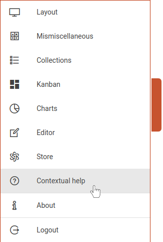

# Tour

Here is a quick rundown of the *key concepts* to handle when you're just starting to use tours.

Tours are designed to help users discover the different features and functionality of the KApp in an interactive way.

::: warning
You will first have to follow the required steps to create your account then connect to make everything works as expected.
:::

You can run the tutorial from this [link](https://kapp.dev.kalisio.xyz/#/home/layout?tour=home), or open the application at the right place then click on the following icon <a href=""><i class="las la-question-circle"/></a> in the main menu.

::: tip
To open the main menu use the handle on the left side of your screen.
:::

You can then follow the step by step guide <a href=""><i class="las la-chevron-right"/></a> (or <i class="las la-arrow-right"/> key), go back if required <a href=""><i class="las la-chevron-left"/></a> (or <i class="las la-arrow-left"/> key) and stop anytime <a href=""><i class="las la-times"/></a> (or *escape* key) as illustrated by the following figure:

## Usage
Tours are configured using a JavaScript file, located in the `src/tours` folder, exporting an array of objects. Each object describes a step of a tour with the following properties: 

- `target`: HTML element you want to highlight
- `title`: Title of the targeted element (String or translation key)
- `content`: Brief description of the targeted element (String or translation key)
- `link`: Textual content of the link  (String or translation key)
- `params` : Object that allows to define additional parameters
  - `placement`: Defines the orientation of the tour step relative to the target element. Possible values are `top`, `bottom`, `left` and `right`. If this property is not specified, the default value is `bottom`
  - `blockOnMiss`: HTML element that allows to block the tour if it is not found in the page
  - `clickOnLink`: HTML element you want to simulate a click on when the link is clicked
  - `tour`: Name of the tour to load if the link is clicked
  - `clickOn`: HTML element on which a clik is generated at the beginning of the step
  - `clickDelay`: Time in milliseconds before `clickOn` is executed
  - `clickOnNext`: HTML element on which a click is generated when the next button is clicked
  - `nextDelay`: Time in milliseconds before the execution of the next step
  - `clickOnPrevious`: HTML element on which a click is generated when the previous button is clicked
  - `previousDelay`: Time in milliseconds before the execution of the previous step

::: tip
All HTM elements mentioned in the documentation can use either an ID (`#my-element`) or a more complex CSS selector (`div[component="layout/Footer"]`)
:::

::: tip
Any property starting with `clickOn` can also be an array of HTML elements. In this case, it is advisable to add a delay. Also, if you want to add a hover effect you can use the keyword `hover` (e.g. `hoverClickOnLink`)
:::

::: details side-nav.js configuration example
<<< @/.vuepress/public/side-nav-tour.js
:::
